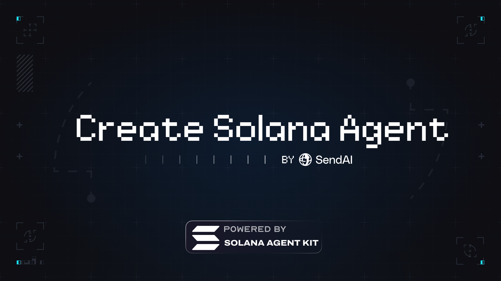

<div align="center">

# create-solana-agent



[](https://www.npmjs.com/package/create-solana-agent)
[](https://www.npmjs.com/package/create-solana-agent)
[](https://github.com/sendaifun/create-solana-agent/blob/main/LICENSE)


</div>

:zap: Get up and running fast with Solana agents :zap:

Create a new AI agent chat UI with [Solana Agent Kit](https://kit.sendai.fun/) in 10 seconds:

```shell
npx create-solana-agent@latest
```

## Overview

Create Solana Agent is a single line command that helps you bootstrap a new AI agent interface for Solana blockchain interactions. It provides a modern, minimalist UI with built-in support for multiple AI models and Solana protocols.

## Features

- 🤖 Multiple AI Model Support
  - Claude 3 Sonnet
  - GPT-4
  - DeepSeek Chat
- 🎨 Modern, minimalist UI with dark/light mode
- ⛓️ Interact with 20+ Solana Protocols via [Solana Agent Kit](https://kit.sendai.fun/)
- 💬 Real-time chat interface with markdown support
- 🔄 Session management and chat history
- 🏗️ Built with:
  - Solana Agent Kit
  - Next.js 14 (App Router)
  - TypeScript
  - Tailwind CSS
  - Shadcn UI
  - Langchain SDK

## Quick Start

### Prerequisites

- Node.js 18.17 or later
- npm, yarn, or pnpm (latest versions preferred)

### Installation

1. Create a new project:
   ```bash
   npx create-solana-agent@latest
   ```

2. Follow the CLI prompts to configure your project:
   - Project name
   - RPC URL
   - AI model selection
   - API keys
   - Solana wallet

3. Start the development server:
   ```bash
   cd your-project-name
   pnpm install
   pnpm run dev
   ```

## Environment Variables

Required environment variables:

```env
MODEL=claude-sonnet|gpt-4|deepseek-chat
ANTHROPIC_API_KEY=your_api_key  # For Claude
OPENAI_API_KEY=your_api_key     # For GPT-4
DEEPSEEK_API_KEY=your_api_key   # For DeepSeek
RPC_URL=your_solana_rpc_url
SOLANA_PRIVATE_KEY=your_private_key
```

## Customization

### Styling

The project uses Tailwind CSS for styling. Customize the theme in `tailwind.config.ts`:

```typescript
export default {
  theme: {
    extend: {
      colors: {
        // Add your custom colors
      }
    }
  }
}
```

### Components

UI components are built using shadcn/ui. Add new components:

```bash
npx shadcn add [component-name]
```

## Contributing

1. Fork the repository
2. Create your feature branch
3. Commit your changes
4. Push to the branch
5. Create a new Pull Request

## License

This project is licensed under the MIT License - see the [LICENSE](LICENSE) file for details.

## Support

- Documentation: [Solana Agent Kit Docs](https://kit.sendai.fun)
- Issues: [GitHub Issues](https://github.com/sendaifun/create-solana-agent/issues)

## Acknowledgments

- [Solana Agent Kit](https://kit.sendai.fun)
- [Next.js](https://nextjs.org)
- [shadcn/ui](https://ui.shadcn.com/)
- [Tailwind CSS](https://tailwindcss.com)
- [Vercel AI SDK](https://sdk.vercel.ai/)
